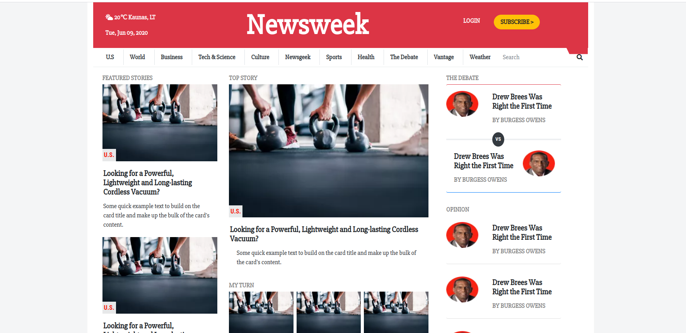

# Solo-PROJECT-USING-BOOTSTRAP

In this project, i'm using Twitter’s Bootstrap framework to build a site – Newsweek.

The page tries to replicate as much as possible the NewsWeek Web page.

## Built With

- Html,
- CSS
- BootStrap

## Live Demo

[Live Demo Link](https://rawcdn.githack.com/visva-dev/PROJECT-USING-BOOTSTRAP/16b4c750cf2036c3ba2fab6e4cbd68c061dc048f/index.html)

## Authors

👤 **Visvaldas Rapalis**

- Github: [@visva-dev](https://github.com/visva-dev)
- Twitter: [@Visva_Dev](https://twitter.com/Visva_Dev)
- Linkedin: [@Visvaldas-Rapalis](https://www.linkedin.com/in/visvaldas-rapalis/)

## 🤝 Contributing

Contributions, issues and feature requests are welcome! Start by:

- Forking the project
- Cloning the project to your local machine
- `cd` into the Youtube-Replica project directory
- Run `git checkout -b your-branch-name`
- Make your contributions
- Push your branch up to your forked repository
- Open a Pull Request with a detailed description to the development branch of the original project for a review

## 📝 License

This project is [MIT](https://opensource.org/licenses/MIT) licensed.
